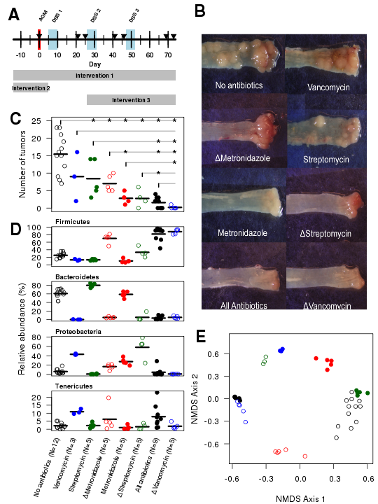
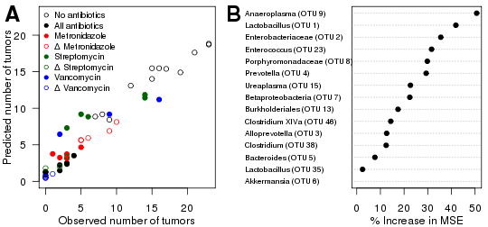
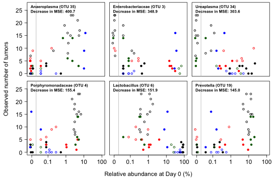
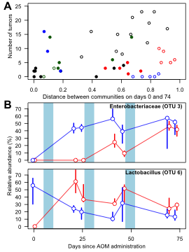
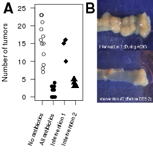
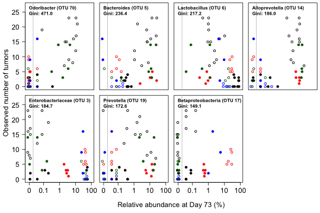

**Manipulation of the Gut Microbiota Reveals Role for Microbial Community
Structure in Colon Tumorigenesis**

Joseph P. Zackular1, Nielson T. Baxter1, Grace Y.
Chen2, and Patrick D. Schloss1*

\* To whom correspondence should be addressed.

<pschloss@umich.edu>

1 Department of Microbiology and Immunology, University of Michigan, Ann
Arbor, MI

2 Department of Internal Medicine, Division of Hematology and Oncology,
University of Michigan, Ann Arbor, MI

\newpage

**Abstract**
There is growing evidence that individuals with colonic adenomas and carcinomas
harbor a distinct microbiota. These alterations may allow the outgrowth of
populations that induce mutations or exacerbate inflammation. In addition, it is
likely that the loss of key populations may result in the loss of protective
functions that are provided for by a healthy microbiota. Using an
inflammation-based murine model of colorectal cancer we explored the
host-microbiota relationship to better understand the role of various
populations through the process of tumorigenesis. By perturbing the microbiota
with mixtures of antibiotics that targeted distinct groups of bacteria we
observed that it was possible to predict the number of tumors that the animals
would harbor by the end of the model. It was apparent that distinct microbiota
could lead to similar numbers of tumors and that variation in the composition of
the microbiota could also lead to wide variation in the number of colonic tumors
that formed. Furthermore, without altering the number of bacteria in the colon,
we were able to fully suppress tumor formation using a combination of
metronidazole and streptomycin. Finally, by altering when the antibiotics were
given to the model we showed that the role of the microbiota in tumorigenesis is
most pronounced during the period of inflammation rather than in the processing
of the mutagen. These results suggest that altering the structure and function
of the gut microbiota can arrest the course of colorectal cancer.

**Keywords:** azoxymethane, dextran sodium sulfate, 16S rRNA gene sequencing,
microbial ecology, microbiome

\newpage

**Introduction**

The mammalian gastrointestinal tract is home to a complex and dynamic community
of microorganisms, termed the gut microbiome, which is essential for maintaining
host health {Bäckhed, 2005 #834}. Among the bacterial populations that make
make up the gut microbiome there are complex interactions that have an important
effect on host health {Levy, 2013 #3476; Marino, 2014 #3290; Lepp, 2004 #844}.
The number of diseases that are associated with abnormalities in the
gut microbiome highlights the importance of these ecological interactions
{Turnbaugh, 2006 #1519;Tamboli, 2004 #3477;Saulnier, 2011 #3478}. Over the
last several years it has been well documented that perturbations to this
community are associated with colorectal cancer (CRC) in humans and mice
{Chen, 2013 #2734;Chen, 2012 #2684;Kostic, 2011 #2435;Geng, 2013 #2686;Shen,
2010 #2687;Sobhani, 2011 #2444;Wang, 2012 #3286;Ahn, 2013 #3263}. We have
previously shown that CRC-associated changes in the gut microbiome directly
potentiate colon tumorigenesis in a mouse model of CRC {Zackular, 2013 #3305}.
In that study we observed clear shifts in the microbiome that could be
associated with a stepwise progression in the number of tumors that were found
in the colon. In addition, we showed that transfer of the tumor-associated
microbiota to germ-free mice resulted in increased tumor formation relative to
germ-free mice receiving the microbiota of healthy mice. These results were
supported by a subsequent study where we colonized germ-free mice with the
microbiota of human donors and observed significant variation in the number of
tumors that formed {Baxter, 2014 #3469}. Combined, these results demonstrate
that the microbiota interact with the host to potentiate tumorigenesis. A
critical question that remains unanswered is what factors and ecological
principles mediate the gut microbiome's influence on this process. Deciphering
how changes in community composition and structure disturb these interactions,
and subsequently modulate tumorigenesis, is an essential step in understanding
the etiology of CRC.

Several bacterial populations including *E. coli*, *Bacteroides fragilis*, and
*Fusobacteirum nucleatum* have been shown to directly influence the process of
tumorigenesis in the colon. The mechanisms by which bacteria potentiate these
processes range from the production of carcinogenic toxins {Arthur, 2012 #2681;
Sears, 2008 #3265} to direct manipulation of the inflammatory status in a
tumor's microenvironment {Kostic, 2013 #3285; Rubinstein, 2013 #3264}. Although
individual bacterial populations undoubtedly modulate colorectal cancer, there
are likely a myriad of commensal bacteria that work together to influence
tumorigenesis in the colon. This is supported by several studies that have
explored the gut microbiome associated with individuals with CRC {Chen, 2013
#2734;Chen, 2012 #2684;Kostic, 2011 #2435;Geng, 2013 #2686;Shen, 2010
#2687;Sobhani, 2011 #2444;Wang, 2012 #3286;Ahn, 2013 #3263;Zackular, 2014
#3457}. Each of these studies reported abnormal shifts in the gut microbiome;
#however, there were no specific CRC-associated bacterial populations that were
#consistently identified across all individuals or studies. This is likely due
#to the fact that there is significant functional redundancy within the gut
microbiome and various bacterial populations may fill similar roles in
tumorigenesis {Lepage, 2013 #3479; Turnbaugh, 2009 #2387; Qin, 2010 #2337}.
Furthermore, some bacterial populations have been hypothesized be protective
against CRC {Louis, 2009 #3480; Appleyard, 2011 #3494}. This protective
phenotype may be mediated through metabolite production, induction of
immunotolerance, or an ability to outcompete pathogenic bacteria {Zhu, 2011
#3497}. We hypothesize that multiple bacteria in the gut microbiome have the
potential to play antagonistic or protective roles in tumorigenesis; thus, the
gut microbiome's influence on CRC is likely to be polymicrobial.

Altering the composition of the microbiome in an inflammation-based mouse model
of CRC resulted in varying numbers of colonic tumors. We also treated
conventionally-raised mice with a cocktail of metronidazole, streptomycin, and
vancomycin in their drinking water while they received the tumor-inducing
treatment and observed a significant decrease in tumorigenesis {Zackular, 2014
#3457}. In the current study, we explored this result further by altering the
composition of this antibiotic cocktail to test the hypothesis that the gut
microbiome structure mediates tumor multiplicity and severity. To better
understand the composition of the microbiome and its dynamics, we extended this
result by permuting the composition of the antibiotic cocktail and associated
changes in the microbiome with the number of tumors that formed. These results
confirmed our hypothesis that the microbiome is capable of driving
tumorigenesis. To further test this hypothesis, we designed an antiboitic-based
intervention to determine whether it was possible to arrest tumorigenesis. Our
analysis supports a model by which individual bacterial populations play an
important role in CRC, but the ecological interactions and community structure
of the gut microbiome mediate the capacity to modulate tumorigenesis.

**Results**

***Antibiotic perturbation of the gut microbiome modulates tumorigenicity.***
We subjected conventionally-raised C57BL/6 mice to an inflammation-based model
of colorectal cancer that utilizes azoxymethane (AOM) as a mutatgen and dextran
sodium sulfate (DSS) to induce inflammation {Zackular, 2013 #3305; Baxter, 2014
#3469} (Figure 1A). As a test of the hypothesis that the microbiota are
involved in tumorigenesis, we manipulated the microbiota by administering eight
antibiotic treatment groups and then quantified the effects of the treatments on
the number of tumors observed at the end of the model. Specifically, we treated
mice with (i) no antibiotics, (ii) metronidazole, streptomycin, and vancomycin
(all antibiotics), (iii) streptomycin and vancomycin ($\Delta$ metronidazole),
(iv) metronidazole and vancomycin ($\Delta$ streptomycin), (v) metronidazole and
streptomycin ($\Delta$ vancomycin), (vi) metronidazole, (vii) streptomycin, and
(viii) vancomycin. Quantitative PCR targeting the 16S rRNA gene indicated that
the number of copies of the 16S rRNA gene did not differ between the treatment
groups. The three antibiotics were selected because they were thought to target
different groups of bacteria including anaerobes (metronidazole), Gram-negatives
(streptomycin), and Gram-positives (vancomycin). By sequencing the 16S rRNA
genes that were present in the feces of the mice that were treated with the
antibiotics it was clear that these treatments resulted in different starting
communities (Figure 1B); however, the composition of these communities was not a
predictable result of the antibiotic that was used to treat the mice. In support
of our hypothesis we observed that antibiotic treatment resulted in a decrease
in tumor multiplicity relative to the mice that did not receive antibiotics
(Figure 1CD). These results demonstrated that perturbation of the microbiota
through the use of antibiotics yields a differential capacity for colon
tumorigenesis.

***The final tumor burden can be predicted from the initial microbiota.***
Because we obtained serial fecal samples it was possible to ascertain the
composition of the microbiota for each mouse as well as the number of tumors in
its colon at the end of the model. Using the 16S rRNA gene sequence data
generated from feces collected on the day of AOM injection, we assigned the
sequences to operational taxonomic units (OTUs) that were defined as a group of
sequences that, on average, were not more than 3% different from each other. We
then used the regression-based random forest machine learning algorithm to
identify OTUs that would enable us to predict the number of tumors that were
found in the same mice at the end of the model. The model that included OTUs
that had an average relative abundance greater than 1.5% resulted in the
greatest percentage of the variance explained (Supplementary Figure 1). This
model included 15 OTUs and explained
62.6% of the variation in the tumor counts (Figure 2).
As suggested in Figure 2A, when the OTUs were sorted in decreasing order by
their Gini coefficient, there was a jump between the sixth and seventh OTUs. In
fact, when we reconstructed the model using only the six OTUs that provided the
largest Gini coefficients, the model explained
62.8% of the variation in the tumor
counts. These six OTUs included members of the Firmicutes (OTU 6), Bacteroidetes
(OTUs 4 and 19), Proteobacteria (OTU 3), and Tenericutes (OTUs 34 and 35).
Increased numbers of tumors were associated with decreases in the relative
abundance of relatives of the Enterobacteriaceae (OTU 3), *Ureaplasma* (OTU 34),
and *Lactobacillus* (OTU 6) and increases in the relative abundance of the
*Anaeroplasma* (OTU 35), Porphyromonadaceae (OTU 4), and *Prevotella* (OTU 19).
Our random forest modeling demonstrated that it was possible to predict the
number of tumors at the end of the model based on the composition of the
microbiota at the beginning of the model.

***The final tumor burden can be predicted from the final microbiota.***
Similar to our analysis using the initial composition of the microbiota, we
developed a random forest regression model to predict the number of tumors in
the mice based on the composition of the microbiota at the end of the model. The
model included 11 OTUs after we again applied a filter
requiring each OTU to have an average relative abundance of at least 1.5%. The
model explained 52.9% of the variation in
the tumor counts (Supplementary Figure 2), which is less than we observed when
we modeled tumor counts based on the initial community composition. The seven
most important OTUs in the model explained 55.4%
of the variation and included *Odoribacter* (OTU 70), *Bacteroides* (OTU 5),
*Lactobacillus* (OTU 6), Enterobacteriaceae (OTU 3), *Alloprevotella* (OTU 14),
*Prevotella* (OTU 19), and Betaproteobacteria (OTU 17) (Supplementary Figure 3).
Interestingly, of the OTUs that were predictive of the number of tumor counts
using the baseline and final community composition data, only three of the OTUs
overlapped. These included *Lactobacillus* (OTU 6), Enterobacteriaceae (OTU 3),
and *Prevotella* (OTU 19). These results confirm those of our earlier study
where we used mice that did not receive antibiotics and the sequencing was
performed using the 454 platform {Zackular, 2013 #3305}.

***The microbial community is dynamic.***
Using mice that were colonized with human feces, we observed that the the level
of tumor burden was associated with the amount of change in the community
structure over the course of the AOM-DSS model {Baxter, 2014 #3469}. In the
current study, however, there was a non-significant association between the
change in the community structure as measured by the \thetaYC metric
of community structure similarity and tumor burden (\rho=0.26,
P=0.08; Figure 4A). The mice that did not
receive antibiotics and those that received the $\Delta$ vancomycin and $\Delta$
metronidazole treatments changed the most over the course of the model. When we
investigated the temporal progression of the three OTUs that were important in
predicting the number of tumors based on the starting and final community
structure (i.e. OTUs 3, 6, and 19) we observed a dynamic progression across the
model. Not sure what else to say here...

***Antibiotic intervention narrows possible mechanisms of microbiome involvement
in tumorigenesis.***
The AOM-DSS model has been shown to reproduce the patterns seen in human CRC.
AOM induces DNA damage and the DSS treatments induces inflammation. To determine
whether the gut microbiome facilitates tumorigenesis by modulating AOM-induced
mutations or inflammation, we performed two antibiotic intervention experiments.
We first treated mice with the full antibiotic cocktail two weeks prior to the
administration of AOM and up until the first round of DSS (Figure 1A). We found
that these mice had a similar tumor burden to untreated mice (Figure 5). Next,
we treated mice before the second round of DSS administration, following the
initiation of AOM/DSS mediated tumorigenesis and inflammation (Figure 1A). In
this treatment, there was a significant decrease in the number of tumors (Figure
5). These results suggest that the gut microbiome mediated affect on CRC is
independent of AOM carcinogenesis. Furthermore, it shows that targeting the gut
microbiome at later stages of tumor growth is a viable option for minimizing
tumorigenesis and highlights microbiome manipulation as a potential therapeutic
in CRC.  

**Discussion**

In the present study, we established the importance of the microbial community
structure in mediating the gut microbiome’s capacity for tumorigenesis. We
demonstrated that manipulation of the murine gut microbiome with an assortment
of antibiotic treatments resulted in non-overlapping community structures with a
disparate level of tumorigenesis. Enrichment in the relative abundance of
several bacterial populations was associated with high and low levels of colonic
tumors. We determined that outgrowth of potentially inflammatory members of the
gut microbiome only mediated increased tumorigenesis when there was a
corresponding decrease in potentially protective, butyrate producing, bacteria.
By perturbing the community at various time points in the AOM/DSS model, we
determined that the gut microbiome is likely potentiating tumorigenesis
independent of AOM-carcinogenesis. Our experiments also demonstrated that
targeting the gut microbiome at the first signs of dysbiosis is a viable
strategy for the amelioration of colon tumorigenesis.

In recent years, there has been a focus on identifying bacterial populations
that are etiologic agents of CRC. Several commensal bacteria, including *E. coli*,
*Fusobacterium nucleatum* and enterotoxigenic *Bacteroides fragilis* (ETBF)
have been linked to CRC in humans {Arthur, 2012 #2681; Rubinstein, 2013 #3264;
Sears, 2008 #3265}. *F. nuceleatum* can manipulate the inflammatory environment
on in the tumor microenvironment in multiple intestinal neoplasia mice and in
the studied population has been detected on the surface of over 50% of adenomas
{Kostic, 2013 #3285;Kostic, 2011 #2435}. ETBF increases tumor multiplicity in
the colon of multiple intestinal neoplasia mice through the action of a secreted
metalloprotease toxin. It has been estimated that between 5-35% of people carry
ETBF {Housseau, 2010 #3498}. Although there is substantial evidence for a
role in potentiating tumorigenesis, the fact that each of these bacteria is only
associated with a fraction of CRCs suggests that it is unlikely that there is a
single microbial agent that causes cancer. Rather, the gut microbiome’s role in
CRC is likely polymicrobial. The results in the present study support this
hypothesis, as we demonstrated that non-overlapping community structures could
confer similar levels of tumorigenesis in mice. When we examined the relative
abundance of bacterial populations associated with increased tumor burden, we
never observed all three treatment groups with high tumor levels (vancomycin
only, streptomycin only, and ∆metronidazole) showing a consistent enrichment.
The same was observed with potentially protective populations across all
treatment groups that developed significantly less tumors (All antibiotics,
∆vancomycin, ∆streptomycin, and metronidazole only). This suggests that various
bacteria within the gut microbiome may confer the same function and be playing
redundant tumor-modulating roles.

During the time course of tumorigenesis we observed a marked increase in members
of the *Enterobacteriaceae* associated with two antibiotic treatment groups
(∆metranidazole and ∆vancomycin). Interestingly, one treatment group
(∆vancomycin) developed fewer tumors despite a similar increase in
this potentially tumor-modulating bacterial clade. A recent study by Arthur
and colleagues {Arthur, 2012 #3490} showed that in an IL-10-deficient
colitis-associated mouse model of CRC; there is an enrichment of
*Enterobacteriaceae* associated with inflammation. This leads to an expansion of
*E. coli* populations with genotoxic capabilities and a consequential increase
in tumor multiplicity and invasion. Furthermore, members of the
Enterobacteriaceae have been shown to perpetuate inflammation in several
inflammatory diseases, including ulcerative colitis, which increase an
individual’s risk of developing CRC {Rolhion, 2007 #3499; Garrett, 2007 #3501;
Rooks, 2014 #3502}. When we further examined the two antibiotic treatment
groups, we observed that mice with an increased tumor burden had a corresponding
decrease in several potentially anti-inflammatory and butyrate producing
bacterial populations. These observations support a model by which the
pathogenicity of individual members of the gut microbiome is mediated by the
community structure and ecological interactions within the gut microbiome. We
hypothesize that inflammatory and carcinogenic commensal bacteria, such as
*Enterobacteriaceae,* can only mediate a pathogenic phenotype if the context of
the community structure is conducive.

One mechanism, by which community structure likely mediates tumorigenicity, is
through shifts in the balance of immunomodulatory metabolites and signals.
During health, the gut microbiome is an important mediator of immunotolerance,
but when the balance of pro- and anti-inflammatory signals is disrupted gut
pathologies can arise [Kelly et al., 2005 *what is this???*]. In our mice, Enterobacteriaceae is
likely acting as an inflammatory member of the gut microbiome. We only observed
an increase in tumorigenesis when there was a corresponding depletion of
potentially protective members of the genera *Clostridium, Enterococcus, and
Streptococcus*. Members of the *Clostridium* are known producers of short chain
fatty acids (SCFA) in the colon {Louis, 2009 #3480}. SCFA, specifically
butyrate, are important nutrients for colonocytes and they also possess
anti-inflammatory and anti-tumor properties. Furthermore,
*Enterococcus* and *Streptococcus* species have been linked to down-regulating
the inflammatory response in the colon {Wang, 2008 #3503; Kaci, 2011 #3504}. It
is likely that these bacterial populations have the ability to antagonize
inflammatory clades (e.g. *Enterobacteriaceae*) and confer protection; however,
when perturbation to the microbial community structure disrupts this
homeostasis, these opportunistic pathogens can potentiate tumorigenesis

In our previous work, we demonstrated that dysbiosis of the gut microbiome
generates a pro-inflammatory environment which results in a self-reinforcing
pathogenic cascade between the gut microbiome and the host {Zackular, 2013
#3305; Baxter, 2014 #3469}. In this study we demonstrated that antibiotic
manipulation of the gut microbiome after the initiation of inflammation and
tumorigenesis can significantly decreased tumorigenesis in mice. This highlights
the efficacy of targeting the gut microbiome in CRC. Additional studies are
needed to explore the viability of manipulating the gut microbiome in CRC with
methods such as diet, probiotics, and prebiotics.

**Materials & Methods**

**Animals and animal care.** Studies were conducted using adult (8 to 12 week
old) age-matched C57BL/6 male mice that were maintained under SPF conditions.
Mice were co-housed in groups of five and fed the same autoclaved chow diet. All
animal experiments were approved by the University Committee on Use and Care of
Animals at the University of Michigan.

**Inflammation-induced colon tumorigenesis.** Mice received a single
intraperitoneal (i.p.) injection of azoxymethane (10 mg/kg). Water containing
2% DSS was administered to mice beginning on day 5 for 5 days followed by 16
days of water. This was repeated twice for a total of 3 rounds of DSS
{Zackular, 2013 #3305}. Mice were euthanized 3 weeks after the third round of
DSS administration for tumor counting. At necropsy, all colons were harvested,
flushed of luminal contents, and cut open longitudinally to count and measure
tumors.

**Antibiotic treatment.** Mice were treated with all possible combinations of
metronidazole (0.75 g/L), streptomycin (2 g/L), and vancomycin (0.5 g/L) to
create eight treatment groups: no antibiotics, all antibiotics (n=5)
(metronidazole, streptomycin, and vancomycin), $\Delta$ metronidazole (n=5)
(streptomycin and vancomycin), $\Delta$ streptomycin (n=5) (metronidazole and
vancomycin), $\Delta$ vancomycin (n=5) (metronidazole and streptomycin), metronidazole
only, streptomycin only, and vancomycin only (n=3). Antibiotics were
administered in mouse drinking water for 2 weeks prior to and throughout the
duration of AOM/DSS administration, unless otherwise specified in Figure 1A.
Tumors were enumerated at the end of the model.

**16S rRNA quantitative PCR (qPCR) analysis.** Relative bacterial loads were
quantified by qPCR analysis of bacterial genomic DNA using KAPA SYBR-fast
Master Mix (KAPA biosciences) and universal 16S rRNA gene primers (F:
ACTCCTACGGGAGGCAGCAGT; R: ATTACCGCGGCTGCTGGC) {Vaishnava, 2011 #3505}.
Samples were normalized to fecal mass and relative fold change was determined
using untreated stool samples for each replicate mouse. Note that qPCR
measures relative fold change of 16S rRNA gene copy number, not actual bacterial
numbers.

**DNA extraction and 16S rRNA gene sequencing** Fecal samples were collected
daily from the mice throughout the AOM/DSS protocol and immediately frozen for
storage at -20°C. For each mouse, 8 fecal samples distributed over the 73-day
timeline of the AOM/DSS model were selected for analysis (Figure 1A). Microbial
genomic DNA was extracted using the PowerSoil-htp 96 Well Soil DNA Isolation Kit
(MO BIO laboratories) using an EpMotion 5075. The V4 region of the 16S rRNA gene
from each sample was amplified, sequenced using the Illumina MiSeq Personal
Sequencing platform, and curated as described previously using the mothur
software package {Kozich, 2013 #2719; Schloss, 2009 #1816}. Briefly, we reduced
sequencing and PCR errors by requiring reads to fully overlap and in cases where
base calls conflicted, we broke the conflict by requiring one base call to have
a PHRED quality score 6 units higher than the other otherwise the base call was
replaced with an ambiguous base call in the contig. Any reads containing
ambiguous base calls were culled. Sequences were aligned to a customized version
of the SILVA 16S rRNA sequence database {Pruesse, 2007 #1735} and were screened
to insure that they correctly overlapped within the V4 region. Chimeric
sequences were identified using the de novo implementation of UCHIME and they
were culled {Edgar, 2011 #2406}. The resulting sequences had a median length of
253 nt and we rarefied to 2,500 sequences per sample to limit effects of uneven
sampling. A mock community was sequenced and processed in parallel to the fecal
samples. Based on the mock community data we observed a sequencing error rate of
0.05%. The complete analysis methods and this document as an R-executable
document are available at
https://github.com/SchlossLab/Zackular_AbAOMDSS_GutMicrobes_2015. All FASTQ
sequence data can be obtained from the Sequence Read Archive at NCBI (Need to
deposit data).

**Acknowledgements**

This work was supported by grants from the National Institutes for Health to PDS
(R01GM095356, R01HG005975, P30DK034933, University of Michigan GI SPORE) and GYC
(University of Michigan GI SPORE and ARRA Supplement P30CA4659-22S3).

**References**

\newpage

**Figure legends**

**Figure 1. Antibiotic perturbation drives changes in microbial community
structure and final tumor burden.** The AOM-DSS model was applied to C57BL/6
mice reared under standard pathogen free (SPF) conditions with different
antibiotic perturbations; Black arrows indicate fecal samples that used for our
analysis (A). The mice were treated with all possible combinations of
metronidazole, streptomycin, and vancomycin to create eight treatment groups,
which resulted in considerable differences in the taxonomic composition of the
gut communities at the start of the model (Day 0) (B). These communities
resulted in a continuum of tumor burden in the mice (C and D).  

**Figure 2. A random forest model successfully predicted the number of tumors in
the mice at the end of the model (A) based on their microbiota composition at the
start of the model (B).** The OTUs in B are ranked in decreasing order of their
Gini coefficient. The relationships between the first 6 OTUs and the number of
tumors found in those mice are shown in Figure 3.

**Figure 3. Relationship between the initial relative abundance of the most
informative OTUs from the random forest model with the number of tumors found
in the mice at the end of the model.** The vertical gray line indicates the
limit of detection.

**Figure 4. The murine microbiota is dynamic but the amount of change is
not associated with the final number of tumors.** The structure of the gut
microbiota associated with untreated and the $\Delta$ metronidazole and $\Delta$
vancoymcin-treated mice changed the most throughout the model as measured using
the $\Theta$YC distance metric (A). OTUs 3, 6, and 19 were among the
most salient features for predicting tumor burden at the beginning and end of
the model (B). The plotting symbols and characters are the same as those used in
Figure 1. In panel B, the median relative abundance is indicated by the plotting
symbol and the range of observed relative abundances is plotted by the vertical
bar. The vertical blue regions indicate when the DSS treatments were applied.

**Figure 5. Antibiotic intervention prior to second administration of
DSS alleviates tumor burden.** Interventions with an antibiotic cocktail
of metronidazole, vancomycin, and streptomycin were performed as
depicted in Figure 1A with enumeration of tumors performed at the end point of
the model (A). Representative images of tumors in the distal colon of mice from
each treatment group (B).

**Supplementary Figure 1. Quality of random forest regression fit as a function
of the minimum average relative abundance an OTU must have to be included in the
model.** The integers displayed across the plot indicate the number of OTUs that
were included in the model. Because a minimum average relative abundance of 1.5%
yielded the best R2, it was used for the remainder of the analysis.

**Supplemental Figure 2. A random forest model successfully predicted the number of tumors in
the mice at the end of the model (A) based on their microbiota composition at the
start end of the model (B).** The OTUs in B are ranked in decreasing order of their
Gini coefficient. The relationships between the first 6 OTUs and the number of
tumors found in those mice are shown in Supplemental Figure 3.

**Supplemental Figure 3. Relationship between the initial relative abundance of the most
informative OTUs from the random forest model with the number of tumors found
in the mice at the end of the model.** The vertical gray line indicates the
limit of detection.

